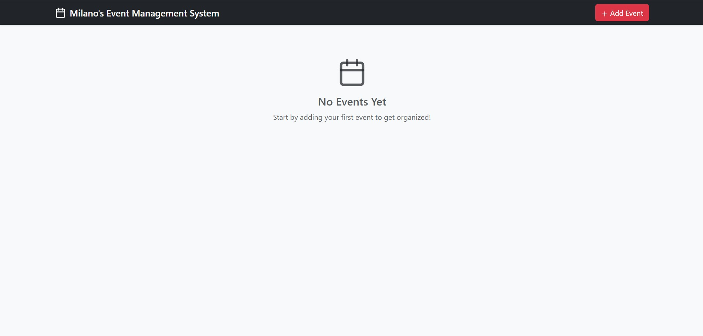
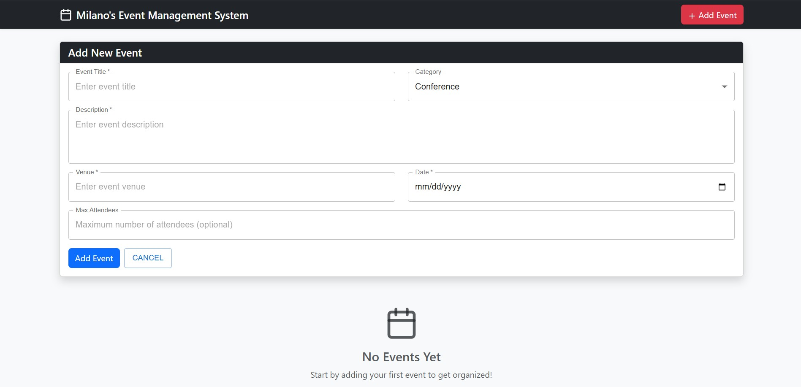
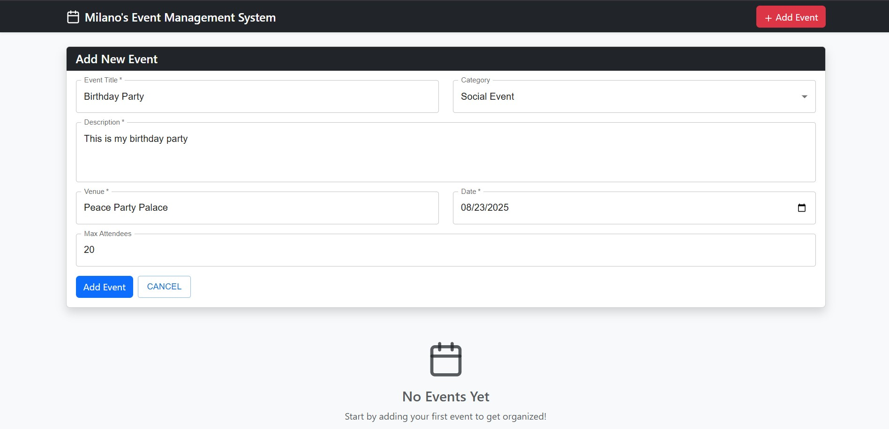
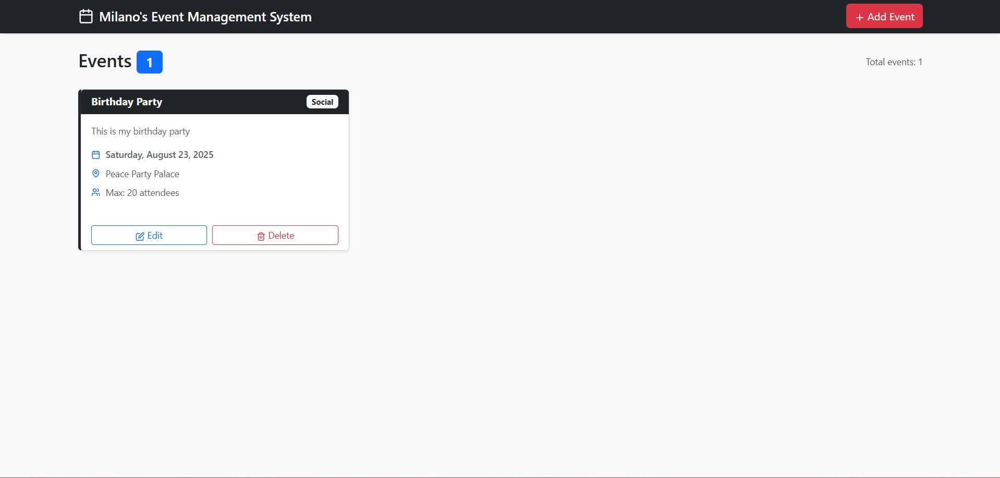

Event Management System
A modern, responsive Event Management application built with ReactJS and Bootstrap. This application allows users to efficiently manage events for organizations with features like adding, editing, deleting events, and viewing them.

🚀 Features
Core Features
Add Events: Create new events with title, description, venue, date, and additional details
View Events: Display events in both list and calendar views
Edit Events: Update existing events with venue/date conflict validation
Delete Events: Remove events with confirmation dialog
Past Event Highlighting: Visual distinction for past events
Additional Features
Event Categories: Categorize events (Conference, Workshop, Seminar, etc.)
Max Attendees: Track event capacity
Responsive Design: Works seamlessly on desktop and mobile devices
Venue Conflict Detection: Prevents double-booking of venues on the same date
🛠️ Technologies Used
React 18.2.0 - Frontend library
Bootstrap 5.3.0 - CSS framework for responsive design
Lucide React - Modern icon library
Material UI 
📁 Project Structure
event-manager/
├── public/
│   └── index.html
├── src/
│   ├── components/
│   │   ├── CalendarView.js    # Calendar view component
│   │   ├── EventCard.js       # Individual event card component
│   │   ├── EventForm.js       # Add/Edit event form
│   │   ├── EventList.js       # List view of events
│   │   └── Header.js          # Navigation header
│   ├── utils/
│   │   ├── dateUtils.js       # Date manipulation utilities
│   ├── App.js                 # Main application component
│   ├── index.js              # Application entry point
│   └── index.css             # Global styles
├── package.json
└── README.md

🚀 Getting Started
Prerequisites
Node.js (version 14 or higher)
npm or yarn package manager
Installation
Extract the project files to your desired directory
Navigate to the project directory:
bash
cd event-management
Install dependencies:
bash
npm install
Start the development server:
bash
npm start
Open your browser and navigate to http://localhost:3000
Building for Production
To create a production build:

bash
npm run build
The build folder will contain the optimized production files ready for deployment.

💡 Usage
Adding an Event
Click the "Add Event" button in the header
Fill in the required fields (Title, Description, Venue, Date)
Optionally add time, category, and max attendees
Click "Add Event" to save
Viewing Events
List View: Shows events as cards with all details
Editing an Event
Click the "Edit" button on any event card
Modify the desired fields
Click "Update Event" to save changes
Deleting an Event
Click the "Delete" button on any event card
Confirm the deletion in the dialog
🎨 Features in Detail
Venue Conflict Detection
The app prevents double-booking by checking if a venue is already reserved for a specific date when adding or editing events.

Past Event Highlighting
Events that have already occurred are displayed with different styling to distinguish them from upcoming events.

Responsive Design

